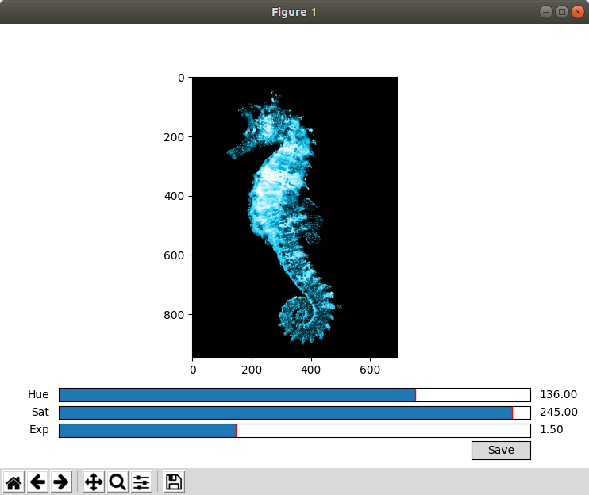
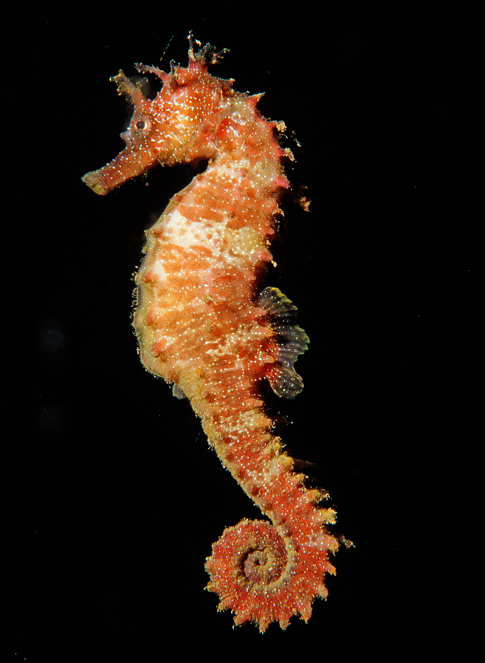
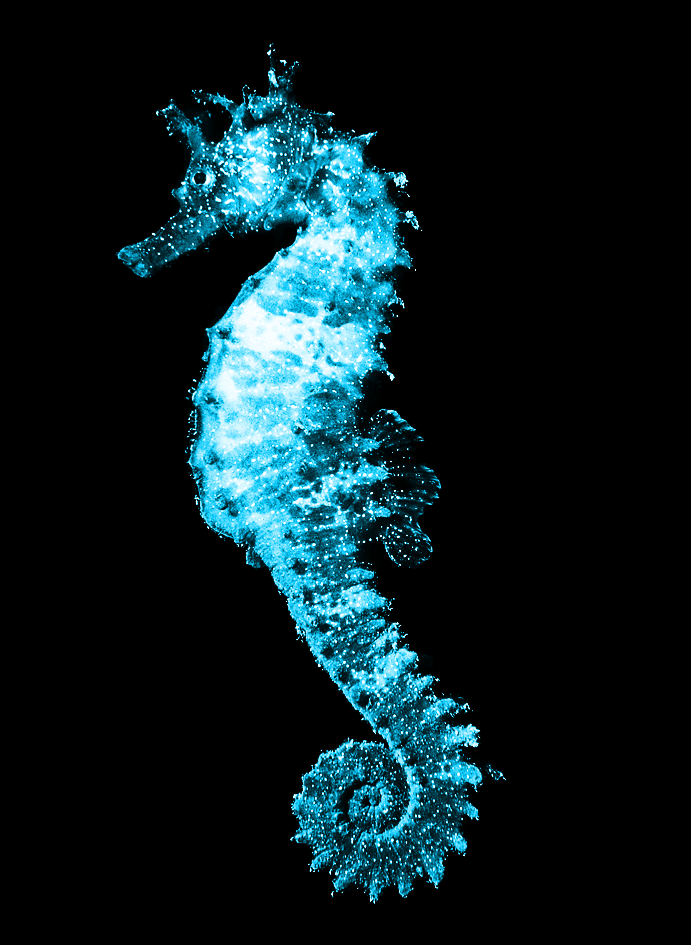
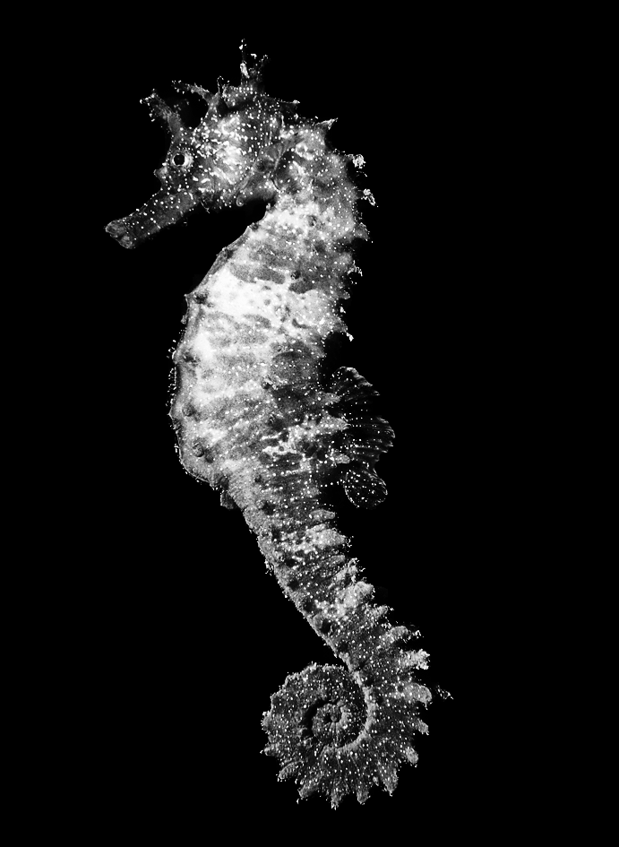
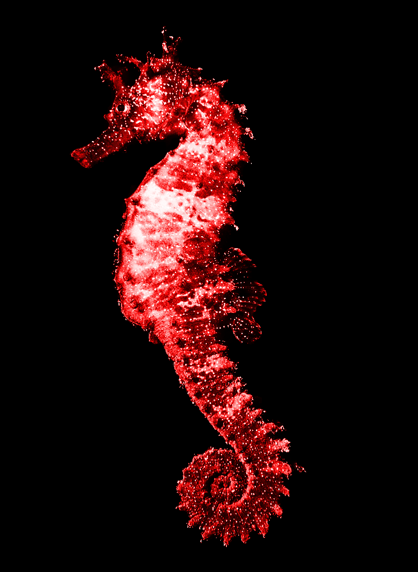
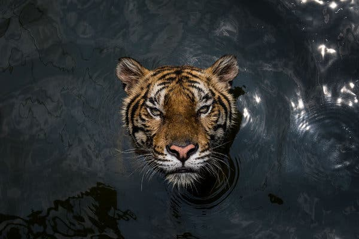
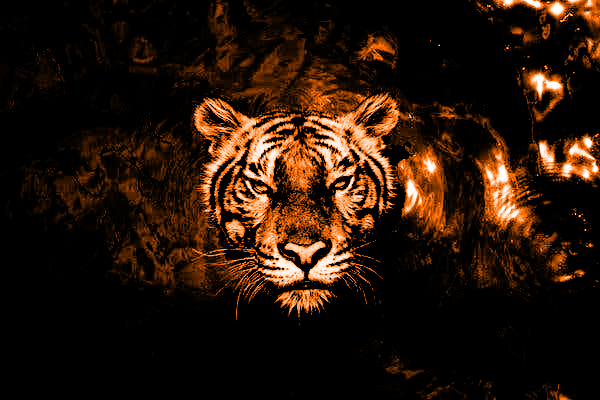
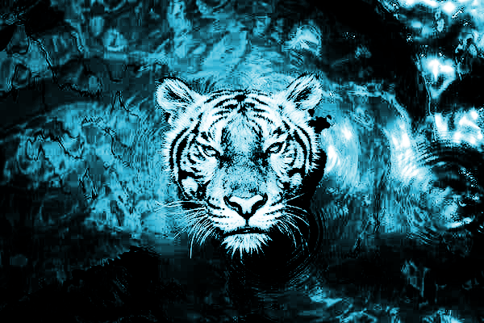

# Photographer transform
This is a script I use to convert an image into a more attractive looking version of itself.

The idea is that the image would look best in black and white and with higher contrast. On top of
that I also wanted the ability to put some color in the image, without losing the contrast or the
monotone aesthetic that black and white has.

To achieve this, this script performs the following:
- (Optional) Make solid backgrounds truly black, i.e. all background pixels are exactly RGB(0, 0, 0).
- Convert to greyscale.
- Perform histogram equalization, i.e. all brightness levels will be equally represented in the image.
- Perform a power transformation of the image intensities, increasing the contrast.
- Use the greyscale image as the L channel in the HSL color space. The hue and luminosity is the
  same for all image pixels and can be set. This preserves the aesthetic of black and white images,
  but introduces a color of choice.

# Installation
To use this script you have to install its Python 3 and some dependencies using:
`pip install numpy opencv-python`

# Usage
The interface can be started by running:
`python -r photographer_transform.py examples/seahorse.jpg`

The `-r` option performs a simple form of background removal that works best for images on a mostly
black background, but it's best left out for most other images. The sliders on the interface can
then be used to set the hue, saturation and exponent for the transformation.

Note that this transform doesn't produce great results for all images. The biggest source of subpar
outputs are a result of the histogram equalization step, a transformation that can easily produce
odd results for certain types of images, resulting in bright or dark blotches on the image.

# Examples
An image of a seahorse.

Transformed using `hue = 136`, `saturation = 245`, `exponent = 1.5` and background removal. 

Transformed using `hue = 0`, `saturation = 0`, `exponent = 3.35` and background removal. 

Transformed using `hue = 0`, `saturation = 245`, `exponent = 1.5` and background removal. 

An image of a tiger.

Transformed using `hue = 18`, `saturation = 255`, `exponent = 10`, without background removal. 

Transformed using `hue = 136`, `saturation = 170`, `exponent = 3.16`, without background removal. 

